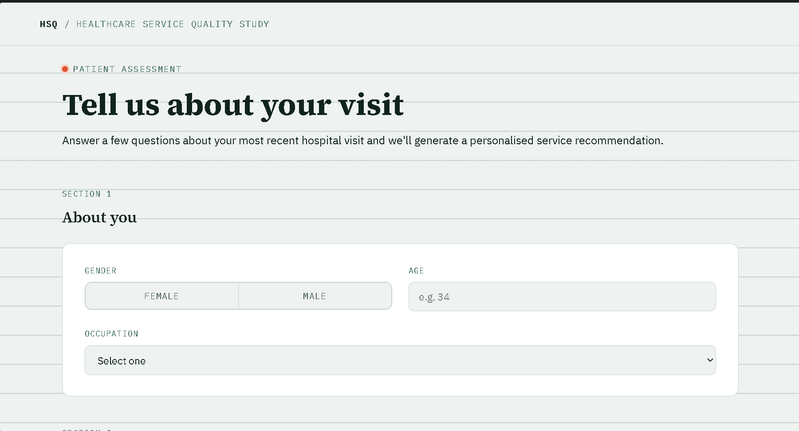

# 🏥 Healthcare Service Quality & Patient Satisfaction

  

## 🌐 Try the Model

### 🚀 Live Prediction

👉 **[Click Here to Try the Healthcare Recommendation Model](https://hospital-survey-and-patient-satisfaction.onrender.com?utm_source=chatgpt.com)**

## 🖥️ Project Interface

  

## 📌 About the Project

This project uses **Machine Learning** to analyze healthcare service quality and patient satisfaction and predict a patient's recommendation.

The project includes:

- 📊 Healthcare survey data analysis
- 🧹 Data preprocessing and encoding
- 🤖 Multiple Machine Learning models
- 🌲 Random Forest as the final model
- ⚖️ SMOTE experiment for class imbalance
- 🌐 Flask web application for prediction
- 📈 Power BI dashboard for visualization

### 🏆 Final Model

**Random Forest — 74.19% Test Accuracy**

The model predicts:

- **Yes**
- **No**
- **Maybe**

> ⚠️ **Important:** This model is trained on a relatively small dataset with limited examples, especially for the **"No"** recommendation class. Therefore, the predictions are for **academic and demonstration purposes only** and should not be considered medically reliable.

---

Enter patient information and the model will generate a **Yes / No / Maybe** recommendation.

---

## 🛠️ Technologies

**Python • Pandas • Scikit-learn • Random Forest • SMOTE • Flask • HTML • CSS • JavaScript • Power BI**

---

## 🔗 GitHub Repository

👉 [View Source Code on GitHub](https://github.com/pradeeproxx22/Hospital-Survey-and-Patient-Satisfaction-Project)

---

## 👨‍💻 Author

**Pradeep Jogi**

MCA — Sri Balaji University, Pune
